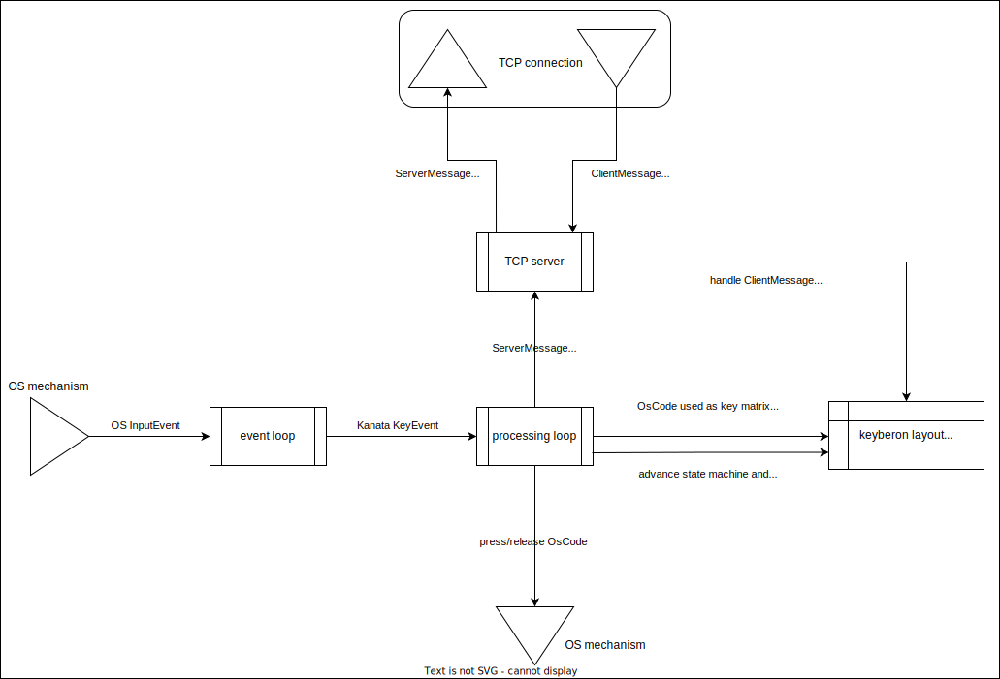

# Design doc

## Obligatory diagram

## main

- read args
- read config
- start event loops

## event loop

- read key events
- send events to processing loop on channel

## processing loop

- check for events on mpsc
- if event: send event to layout
- tick() the keyberon layout, send any events needed
- if no event: sleep for 1ms
- separate monotonic time checks, because can't rely on sleep to be
  fine-grained or accurate
- send `ServerMessage`s to the TCP server

## TCP server

- listen for `ClientMessage`s and act on them
- recv `ServerMessage`s from processing loop and forward to all connected
  clients

## layout

- uses keyberon
- indices of `kanata_keyberon::layout::Event::{Press, Release}(x,y)`:

      x = 0 or 1 (0 is for physical key presses, 1 is for fake keys)
      y = OS code of key used as an index

## OS-specific code

Most of the OS specific code is in `oskbd/` and `keys/`. There's a bit of it in
`kanata/` since the event loops to receive OS events are different.
